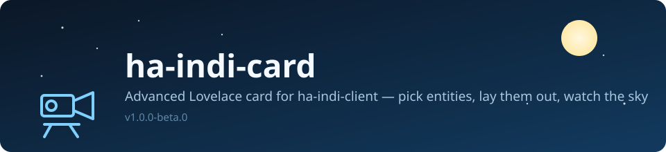

# ha-indi-card



An advanced Home Assistant Lovelace card for [`ha-indi-client`](https://github.com/jan-tdy/ha-indi-client) — build a custom dashboard for your INDI observatory without writing YAML.

> **Status:** `v1.0.0-beta.0` — first beta, and the foundation of a longer-term goal: an in-Home-Assistant alternative to imaging tools like [CCDciel](https://www.ap-i.net/ccdciel/en/start) (capture sequences, live camera view, focus/guide feedback). This release only covers the base: picking entities and laying them out visually, plus an optional live camera image.
>
> **Note:** `ha-indi-client` does not fetch INDI BLOB/image data yet (see its [known limitations](https://github.com/jan-tdy/ha-indi-client#known-limitations)), so there is no camera entity coming from it today. The `camera_entity` option below works with any `camera.*` entity in your system (e.g. from a different integration) — once `ha-indi-client` gains BLOB support, it'll show that image with no changes needed here.

## Features

- **Visual layout editor** — add sections, pick entities with the standard Home Assistant entity picker, reorder entities and sections, all from the card's own GUI editor (no YAML needed to get started).
- **Live camera image** — pick any `camera.*` entity and show its current snapshot at the top of the card (e.g. your INDI CCD/guide camera), with a toggle to hide it.
- **Basic control** — toggleable entities (`switch`, `input_boolean`, `light`, `fan`) get an inline switch; every other entity shows its formatted state. Clicking a row opens the normal Home Assistant more-info dialog.

## Installation

### HACS (custom repository)

This card is not yet in the default HACS store. Add it manually:

1. In Home Assistant, go to **HACS → Frontend → ⋮ → Custom repositories**.
2. Add `https://github.com/jan-tdy/ha-indi-card` as category **Dashboard**.
3. Install **ha-indi-card**, then reload your browser.

### Manual

1. Copy `ha-indi-card.js` into `<config>/www/ha-indi-card.js`.
2. Add it as a Lovelace resource: **Settings → Dashboards → ⋮ → Resources**
   - URL: `/local/ha-indi-card.js`
   - Resource type: `JavaScript Module`

## Usage

Add a new card, search for **INDI Card**, and use the editor to set a title, an optional camera entity, and your sections/entities. Or configure it directly in YAML:

```yaml
type: custom:ha-indi-card
title: INDI Observatory
camera_entity: camera.ccd_simulator
show_camera: true
sections:
  - title: Mount
    entities:
      - sensor.mount_ra
      - sensor.mount_dec
  - title: Focuser
    entities:
      - number.focuser_position
      - switch.focuser_power
```

| Option           | Type    | Default | Description                                          |
| ---------------- | ------- | ------- | ----------------------------------------------------- |
| `title`          | string  | —       | Card header.                                          |
| `camera_entity`  | string  | —       | A `camera.*` entity to show as a live image.          |
| `show_camera`    | boolean | `true`  | Show/hide the camera image without removing the entity. |
| `sections`       | list    | `[]`    | Ordered list of `{ title, entities }` groups.         |

## Roadmap

Longer term, the goal is a dashboard that covers the same ground as dedicated astro-imaging
software (CCDciel, EKOS/KStars) directly inside Home Assistant — planned in rough order:

- Free-form grid/drag-and-drop placement.
- Live camera view fed by `ha-indi-client`'s CCD/guide-camera BLOBs, once it supports them.
- Dedicated widgets for numbers, covers, and climate entities (e.g. focuser position, dome/roof).
- Capture sequence builder (exposure/filter/count lists) and run/status controls.

## License

MIT — see [LICENSE](LICENSE).
